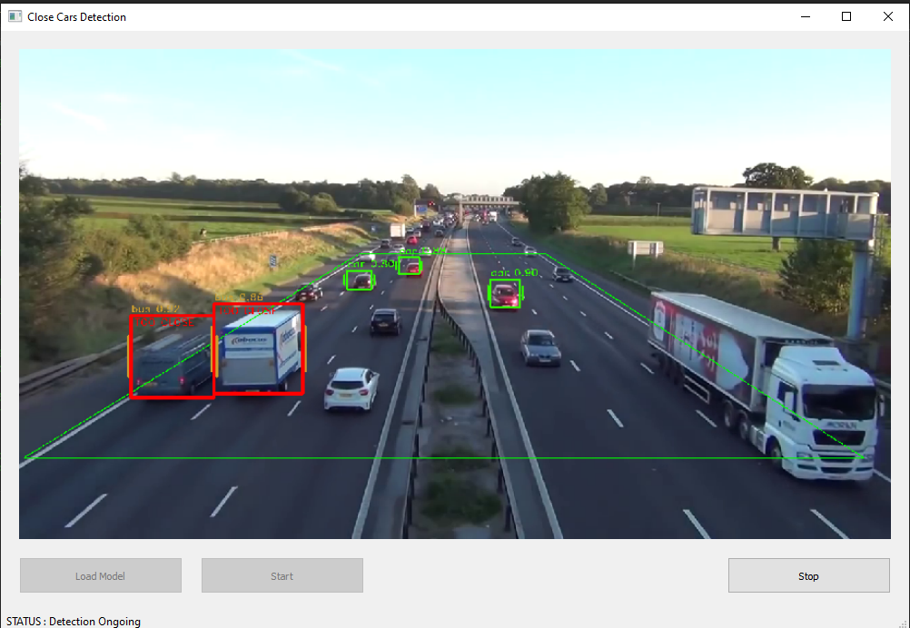

# traffic-surveillance-cars-proximity-detection
This repository contains code for car detection which also alerts whenever any of the cars are getting too close to each other.  
 
<h3>Repository Details</h3>
  1. Contains the complete code for detecting cars, draw bounding boxes with class label and confidence and detect when cars are getting too close to each other. 
  2. Used pretrained faster-rcnn model from tensorflow model zoo and implemented wrapper function for ony vehicle detection.  
  3. The code correctly detects cars and applies a RED bounding boxes and 'TOO CLOSE' label on the cars whenever the get too close to each other.
  4. 'steps_to_use.txt' file contains the steps required the run the 'application.py' file.

 
<h4>Remaining functionalities (To Add) :</h4>
  1. Alert whenever the cars are getting too close  
  2. Create a GUI  
  3. Custom trained model
 
<h4>Example (GUI)</h4>

 
The fact that it is not able to detect is because i used the pretrained model, i still have to train the models on the custom dataset so that it will be able to detect properly.
